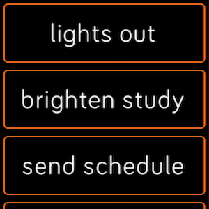
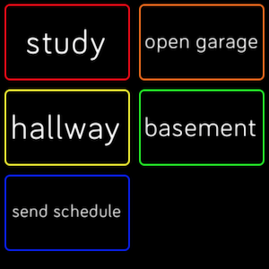

#  hooks

A webhooks app for Fitbit OS

 

Add your webhook(s) from the app settings in the Fitbit mobile app. For IFTTT webhooks, Add your API key (once), and add your events by event name. Custom webhooks are also supported, using full webhook URL.

The colours provided are either one or all of the rainbow colours. You can also choose to have one or two buttons per row from the mobile app settings.

Direct [link to app](https://gam.fitbit.com/gallery/app/61cc13ae-e73c-4026-9a73-2f4d43237503) in Fitbit app gallery.

Bugs, feature requests as well as pull requests are welcome.

### Reference
- Fitbit example [sdk-ifttt-demo](https://github.com/Fitbit/sdk-ifttt-demo)
